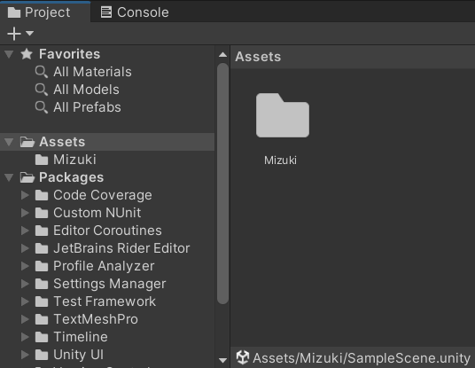

# Robotch

プロジェクトに変更を加える際
・クローンしたプロジェクトファイルを複製
↓
・複製したプロジェクトファイルを Unity で編集
↓
・バグ等、不備が無い状態なら複製したプロジェクトファイルを元のプロジェクトファイルと合体
↓
・合体したプロジェクトファイルをプッシュ
※ブランチ や マージ は事故の元なので複製で代用

Unity でアセット等を操作する際は
Assets 階層直下に自分の名前のフォルダーを作ってそこを操作すること
  
Unity でアセット等を操作する際は  
__Assets__ 階層直下に自分の名前のフォルダを作り  
そこで操作してください。

